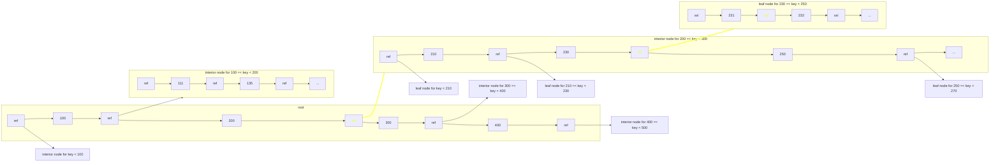

Data stores can be subdivided into two large groupings by usage:
- OLTP (Online Transaction Processing) 
  - frequent writes, usually few rows, but a lot of columns 
  - typically a backbone of a highly-available application (e.g. web)
  - disk seek is typical bottleneck
- OLAP (Online Analytical Processing)
  - Relatively rare reads (analytical queries) 
  - Writes are traditionally rare (batch ETL), but could be more frequent (streaming)
  - Affecting only a few columns, but massive amount of rows
  - disk bandwidth is typical bottleneck
Relational model (SQL) can be quite performant in both cases, but require different tuning 
  - e.g. AWS has Aurora for OLTP and Redshift for OLAP, both are relational

OLAP typically structures data into facts (typically timestamped transactions) and dimensions (additional information where same value can occur in multiple facts)
 - Fact table and 1 layer of dim tables is called a Star schema
 - If broken down further into sub-dimensions (normalization) - called a Snowflake schema
 - Snowflake may be more performant, but harder for analysts to work with as multiple subqueries and joins are required to assemble necessary data

Even when broken down into dim and fact tables, OLAP tables are very wide, hundreds of columns.
- To improve performance, column-oriented storage is used (data is stored not by row, but by column.) 
- Useful when queries only affect some columns. It also lends itself well to compression (e.g. bitmap). 
- Sorting data also helps, but sorting needs to be performed across all column tables as they rely on the same order to tie rows back together. Sort keys are used for this.

OLAP performance may also be improved by pre-calculating results of a specific query. 
  - This is called roll-ups, OLAP cubes, etc
  - usually exists as materialized views (query results stored as derivative tables)
  - only works when the query is frequent and predictable 

OLAPs are usually relational, and relational DBs overwhelmingly use an approach called B-tree to index data and structure it on disk. But indexing is much more important for OLTP dbs where data is stored by row and whole rows are written at a time very frequently. 
For simplicity, we can think of an OLTP as a key-value store, where key is index and value is row, but the same applies for multi-table databases too.
B-tree nodes are called blocks or pages, which contain memory pointers. Pointers are progressively more precise the furthest one gets from the root node. All nodes until the leaf nodes contain pointers to ranges between what keys a key for a given record must be found, and the ranges are widest at the root.

This is an example of b-tree traversal with a query for value of key=231

For writing, B-trees update the leaf for the highest offset, and periodically split it away and build an interior node to route to it. For updates, they update in-place on the leaf, keeping the root and interior nodes unaffected.

But another approach is gaining popularity with key-value store OLTP dbs - Log-Structured Merge Trees.
- All data is stored in tables with string keys, string keys are sorted (SST - Sorted String Table)
- Due to sorting, we can maintain a sparse index (similar to root of B-tree) and split data into segmented SSTs
- When a new value comes in we persist it in memory (so-called memtable)
- When memtable exceeds a given size, we write its contents to disk into a new SST
- For reading, we first look up the key in memtable, if not found - in most recent SST, then in the next one, ...
- Periodically, we compact SSTs by taking all of the segments from all of the times and only keeping the most recent values for each key
Inspired by Google Bigtable, used in Cassandra, HBase, LevelDB, RocksDB, Bitcask, ...

Comparison:
 LSM-trees can get overwhelmed by the amount of writes and fail to compress - at the same time, they never throttle incoming updates so this needs to be monitored.
- LSM-trees tend to be more performant on magnetic hard drives, where sequential writes are much faster than random writes
- LSM-trees have less write amplification (less writes to disk for a given database update).
- LSM-trees are harder to lock up, as the same key can exist in different places. B-trees can lock whole ranges of values directly on the tree(disk)

Some other indexing approaches:
- Covering index - some columns are stored in the index directly. When whole row - it's called a clustered index.
- Multicolumn (but not covering) index
- Fuzzy indexes for full-text search
- Entire in-memory DB
  - VoltDB, MemSQL, Oracle TimesTen
  - Also Redis and CouchDB but they write to disc asynchronously